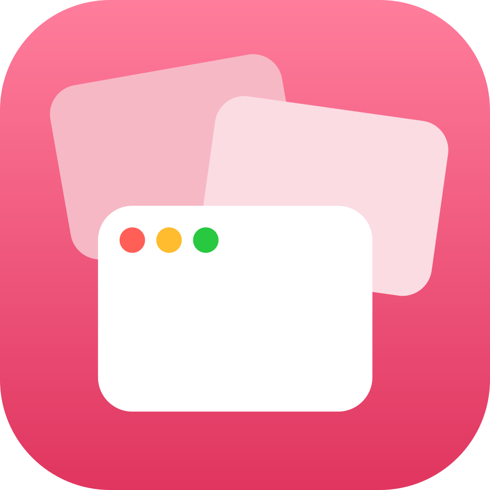

<p align="center">
  
</p>

<h1 align="center">Riffle</h1>

<p align="center">
  Move and resize macOS windows with trackpad gestures. No clicking or tiny window edges required.
</p>

## How it works

Point at a window, hold <kbd>Control</kbd> + <kbd>Shift</kbd>, then:

- Swipe with two fingers to move the window.
- Pinch with two fingers to resize it proportionally around its center.
  - With "Directional Pinch" on, spreading the fingers horizontally changes only the width and vertically only the height. The window keeps its relative place on the screen while it grows or shrinks.
- While moving, snap the window into place:
  - Flick left or right and lift → left or right half. Flick up → maximized.
  - Push the window into a screen edge → that half, or maximized at the top. Push toward a corner → that quarter.
  - From a half, swipe or push up or down → the top or bottom quarter on that side.
  - Wiggle left and right quickly → 80% of the screen, centered.

Riffle targets the window beneath the cursor, even when it is not currently focused. The modifier keys and focus behavior can be changed from its menu bar menu.

## Install

Riffle is currently a personal, source-built utility for macOS 26.2 or later.

1. Clone the repository and open `Riffle.xcodeproj` in Xcode.
2. Select your development team under Signing & Capabilities.
3. Build and run the `Riffle` scheme.
4. Grant Riffle access in System Settings → Privacy & Security → Accessibility.

Riffle runs as a menu bar app without a Dock icon. Use its menu to change the modifier chord, temporarily disable gesture capture, bring moved windows to the front, switch individual snap gestures off, switch the pinch to directional, or launch Riffle at login.

## Development

Run the test suite from the command line:

```sh
xcodebuild test \
  -project Riffle.xcodeproj \
  -scheme Riffle \
  -destination 'platform=macOS' \
  CODE_SIGNING_ALLOWED=NO
```
